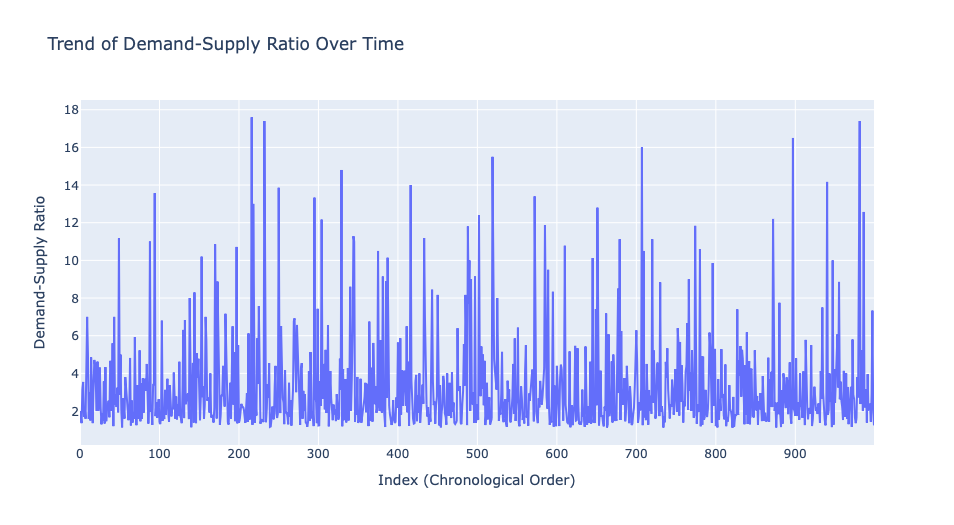
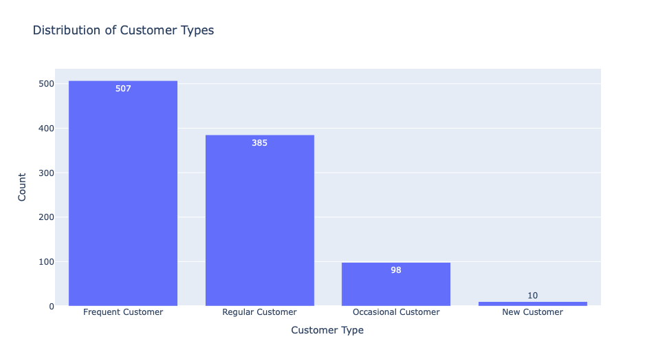

# DYNAMIC PRICING FOR REVENUE AND PROFITABILITY OPTIMIZATION IN RIDE SHARING

## About the Dataset

A ride-sharing company wants to implement a dynamic pricing strategy to optimize fares based on real-time market conditions. The company currently uses only ride duration to decide ride fares. The company aims to leverage data-driven techniques to analyze historical data and develop a predictive model that can dynamically adjust prices in response to changing factors.

The dataset containing historical ride data has been provided. It includes features such as the number of riders, number of drivers, location category, customer loyalty status, number of past rides, average ratings, time of booking, vehicle type, expected ride duration, and historical cost of the rides.

Your goal is to build a dynamic pricing model that incorporates the provided features to predict optimal fares for rides in real time. The model must consider factors such as demand patterns and supply availability. The dataset includes the following features:

- **`Number_of_Riders`**: Number of people requesting the ride.
- **`Number_of_Drivers`**: Number of available drivers at the time.
- **`Location_Category`**: The location where the ride is requested (e.g., urban or suburban).
- **`Customer_Loyalty_Status`**: Whether the customer is a loyal user (could be categorical: Yes/No or 0/1).
- **`Number_of_Past_Rides`**: How many previous rides the customer has taken.
- **`Average_Ratings`**: Ratings given by customers to the driver.
- **`Time_of_Booking`**: The time at which the ride was booked (can be converted to hour, day, week, or part of the day for better analysis).
- **`Vehicle_Type`**: The type of vehicle requested (e.g., sedan, SUV).
- **`Expected_Ride_Duration`**: Estimated time of the ride in minutes.
- **`Historical_Cost_of_Ride`**: The previous fare for a similar ride (dependent variable we want to predict).

## Overview

The problem addressed in this report is the need for a dynamic pricing strategy in the ride-sharing industry to optimize fares based on real-time market conditions. Currently, the company relies solely on ride duration to determine fares, which may not account for the varying factors influencing demand and supply. 

To overcome this limitation, the company aims to develop a data-driven predictive model using historical ride data. The model will dynamically adjust prices by considering critical factors such as the number of riders, number of available drivers, customer loyalty, location category, time of booking, and other relevant attributes. 

This solution will enable the company to enhance its pricing strategy, improving competitiveness and ensuring fair fares for both riders and drivers while maximizing operational efficiency. 

To ensure a clear understanding of the project and its limitations, the following assumptions are made based on the data and project requirements:
 
- The dataset includes all necessary features to predict optimal fares, with no critical feature missing.  
- The dataset values (e.g., `Number_of_Riders`, `Number_of_Drivers`, `Historical_Cost_of_Ride`) are accurate and reflect real-world scenarios.   
- Rows in the dataset represent events in chronological order, and the rows are sequential.  
- Each ride request is unique, with no overlapping rides for the same driver or rider.  
- `Number_of_Riders` and `Number_of_Drivers` accurately represent real-time demand and supply at the time of booking.  
- The `Time_of_Booking` feature effectively captures temporal demand patterns (e.g., peak and off-peak times) without requiring detailed timestamps.  
- The `Location_Category` feature reflects geographical cost differences (e.g., urban areas generally have higher fares than suburban ones).  
- Different `Vehicle_Type` categories have unique base fare structures, with Premium vehicles costing more than Economy vehicles.  
- Each ride instance is independent of others, with no dependency on previous or future rides.  
- The model predicts fares based solely on the provided features, excluding external factors like fuel prices, weather, or traffic conditions.  
- Fares can be adjusted dynamically without significantly affecting demand; small price increases are unlikely to drastically reduce ride requests.  
- The relationships between features (e.g., demand-supply ratio and `Historical_Cost_of_Ride`) are stable and consistent across the dataset.  
- Real-time data for `Number_of_Riders`, `Number_of_Drivers`, and `Time_of_Booking` will be available during deployment.  
- The model will be periodically updated to incorporate changes in demand patterns, customer behavior, or operational dynamics.  
- The company is willing to implement and adjust fares dynamically based on the model's recommendations.  
- There are no regulatory or operational constraints preventing dynamic pricing adjustments.  
- Customers are likely to accept dynamically priced fares based on market conditions.  

## Methodology

The data is public data sourced from Kaggle. The collected datasets were cleaned and preprocessed to ensure data quality and consistency. The preprocessing steps included:

1. **Handling Missing Values**: Missing values were identified and addressed through appropriate techniques, such as imputation or removal, depending on the context.
2. **Feature Engineering**: New features were derived from the existing data to improve the model's predictive power. For example, the `Time_of_Booking` feature was transformed into time-based categories (e.g., hour, part of the day) to capture temporal patterns.
3. **Categorical Encoding**: Categorical variables, such as `Location_Category` and `Customer_Loyalty_Status`, were encoded using techniques like one-hot encoding or label encoding to make them suitable for machine learning models.
4. **Outlier Detection and Treatment**: Outliers were identified in numerical features and treated to avoid skewing the model results.
5. **Normalization and Scaling**: Numerical features, such as `Expected_Ride_Duration` and `Number_of_Past_Rides`, were normalized or scaled to ensure consistent ranges for all variables.

##### Key Observations About The Data
1. The dataset lacks a datetime column but includes features like Time_of_Booking, which indicates temporal aspects of ride requests (e.g., Night and Evening).
2. The rows may or may not be sequentially ordered in time. 

#### Strategies Implemented

To address the problem, the following strategies were employed:

1. **Driver Allocation Strategy**: Optimized the allocation of drivers to high-demand areas based on historical and real-time data to improve availability and reduce wait times.

2. **Customer Segmentation Strategy**: Used customer data to segment users into different categories (e.g., loyalty status, ride frequency) to tailor services and pricing more effectively.

3. **Dynamic Pricing Strategy**: Developed a dynamic pricing model using machine learning algorithms to predict optimal fares based on factors such as demand, supply, location, and booking time.

#### Simulation for Pricing and Promotions

Pricing and promotional strategies were developed and simulated at various levels, including market and booking channels. For example:

- **Simulation of `Booking_Channel`**: Analyzed and simulated booking patterns based on `Time_of_Booking` and `Location_Category` to identify optimal pricing and promotional opportunities.
- **Market-Specific Adjustments**: Tailored pricing and promotions for different markets to maximize revenue and customer satisfaction.

#### Machine Learning Model Development

For the development of the dynamic pricing model, the following steps were performed:

1. **Dataset Splitting**: The dataset was split into training and testing sets using the `train_test_split` function from `sklearn.model_selection` to ensure robust model evaluation.
2. **Baseline Model**: Linear Regression was used as a baseline model for predicting ride fares.

#### Model Evaluation

The final model was evaluated using standard regression metrics, including:

- **Mean Absolute Error (MAE)**
- **Mean Squared Error (MSE)**
- **R-squared**

These metrics ensured the model's reliability and accuracy in predicting optimal ride fares. This comprehensive approach allowed for the successful implementation of a dynamic pricing strategy to enhance revenue and operational performance.

# EDA

The data reveals periods of both upward and downward trends, indicating fluctuations in ride costs over time. Notable peaks and troughs suggest variability in pricing influenced by factors such as demand, location, or ride type. The minimum cost of $25.99 represents a point of low pricing, possibly due to off-peak times or discounts. The maximum cost of $836.12 highlights a significant fare, likely influenced by factors such as long ride duration, premium vehicle type, or peak demand.

**Insights and Implications:** The observed trends emphasize the potential for dynamic pricing strategies to capture and respond to market demand variability effectively.

The data indicates a mix of short and long rides, demonstrating the service's versatility for different trip purposes. The variety in ride duration shows usage for both quick errands and lengthy commutes. Short durations reflect urban commutes or errands. Long durations suggest intercity or long-distance rides, often associated with premium services.

**Insights and Implications:** The variability in ride duration indicates a need for pricing segmentation based on trip type and distance. Tailoring pricing strategies can better cater to diverse customer needs.

The distribution highlights periods of high engagement with frequent riders, interspersed with newer or less active customers. These patterns may reflect the impact of loyalty programs or targeted marketing strategies to encourage repeat rides. The minimum value represents new customers with no prior rides. The maximum value signifies highly engaged customers, likely benefiting from loyalty incentives or frequent usage.

**Insights and Implications:** Patterns in customer ride history reveal opportunities to target specific customer segments with promotions or incentives. For example, occasional riders could be encouraged to ride more frequently through loyalty rewards or tailored offers.

Frequent fluctuations in the demand-supply ratio indicate periods of high demand with insufficient driver availability. Extreme spikes suggest unusual ride demand, potentially caused by events, adverse weather, or city-wide activities. A low ratio reflects a balanced or oversupplied market. A high ratio signifies a severe demand-supply imbalance, likely leading to surge pricing.

**Insights and Implications:** Spikes in the ratio suggest opportunities to optimize driver allocation in areas or times of high demand. This could help mitigate extreme surges, improve service quality, and reduce fare volatility.

The data reveals that:
- Urban areas dominate the distribution with consistent contributions across all rider counts, reflecting the primary demand for the service originating from cities.  
- The suburban layer displays variability with spikes around specific Number_of_Riders values, potentially indicating preferences for family or small group travel.  
- Rural contributions are intermittent, with peaks likely representing occasional larger group requirements or isolated high-demand scenarios.

**Business Implications:**

- **Resource Allocation:**  
  - **Urban Areas:** Continuous driver availability is essential to meet steady demand.  
  - **Suburban Areas:** Strategies should target evening or weekend peaks when group rides are more frequent.  
  - **Rural Areas:** Promotions or specialized services could cater to larger group rides or specific events.  

- **Marketing Focus:**  
  - **Urban:** Highlight everyday convenience and efficiency to attract regular riders.  
  - **Suburban:** Emphasize family-friendly services or rideshare options to appeal to group travelers.  
  - **Rural:** Promote availability for long-distance travel or group events to meet unique local needs.  

  

 The plot shows that only a few locations have a high number of drivers.

**Insights:**
- Urban locations show a steady presence across all bins, with a slight dominance in higher driver counts. This pattern aligns with consistent and high demand in urban areas, necessitating reliable driver availability.  
- Suburban regions contribute significantly in the lower bins, tapering off as driver counts increase. This trend reflects moderate population densities and demand levels typical of suburban areas.  
- Rural areas dominate the first bin, highlighting a scarcity of drivers and lower demand. Minimal contributions in higher bins are consistent with fewer drivers being required for sporadic or low-frequency rides in these regions.

The left-skewed distribution, combined with the dominance of rural areas in the first bin, highlights the disparity in driver availability and demand across location categories. Tailored strategies for recruitment, allocation, and operations can help address these differences effectively.

 
  
## General Relationship  

- The plot reveals a direct and positive relationship between the number of riders and drivers. As the number of riders increases, the number of drivers also tends to rise.  
- The upward-sloping trend line confirms that areas with higher rider counts generally require more drivers to meet demand effectively.  
- The triangular shape indicates that the number of drivers caps the number of riders that can be served at any given time, creating a natural ceiling on rider capacity.  
- Periods where drivers outnumber riders suggest low demand, whereas instances of more riders than drivers indicate potential unmet demand.  
- Urban areas dominate the higher ranges of riders and drivers, reflecting the heavy usage and high demand typical of cities.  
- Suburban and rural regions are clustered at lower rider and driver counts, suggesting smaller-scale operations or less frequent usage.  

**Business Insight:**  
- Balancing the availability of drivers with rider demand is essential, particularly in urban areas where unmet demand is most likely to occur.  
- Rural and suburban regions may benefit from targeted driver incentives or optimized service allocation to enhance operational efficiency and meet localized demand effectively.  

 

- Gold customers consistently incur the highest ride costs across all quartiles, with the highest median fare. This indicates that Gold customers typically request more expensive rides or use premium services.  
- Regular customers exhibit more variability in ride costs, with both a higher Q3 and Q1 than Gold and Silver customers. This suggests that Regular customers may use the service for more varied purposes, including some higher-cost rides.  
- Silver customers tend to have the most consistent and lowest-cost rides overall, with their ride costs clustered towards the lower end of the spectrum.  
- No extreme outliers are observed, indicating that ride costs for all customer groups fall within reasonable and expected limits.  
  
**Business Implications:**
- **Targeted Pricing Strategy:**  
  - **Gold Customers:** With the highest median cost, Gold customers likely prefer premium services. Consider offering exclusive packages and premium options to cater to their preferences.  
  - **Regular Customers:** This group displays mixed spending behavior. Utilize dynamic pricing and explore upselling opportunities to enhance their value and increase overall spending.  
  - **Silver Customers:** Generally, Silver customers have lower spending patterns. Introduce incentives such as discounts and upsells to encourage them to upgrade to higher-tier services.  

- **Customer Retention and Loyalty Programs:**  
  - **Gold Customers:** Retain Gold customers by offering VIP experiences, priority support, and exclusive benefits tailored to their status.  
  - **Regular Customers:** Incentivize upgrades to Gold status by offering rewards and personalized offers, strengthening their loyalty.  
  - **Silver Customers:** Provide loyalty incentives aimed at increasing engagement and facilitating their transition to higher tiers.  

 
  
The oblique trend line suggests a positive correlation between **Expected Ride Duration** and **Historical Cost of Ride**. As the duration of the ride increases, so does the cost. This trend aligns with the idea that longer trips generally involve higher costs due to factors such as distance and time.  
- **Economy Vehicles:** Typically associated with shorter rides and lower costs, as expected.  
- **Premium Vehicles:** Tend to have longer rides and higher costs, supporting the idea that premium services are often used for longer, more expensive trips.

**Business Implications:**
- Businesses should price longer trips higher, particularly for premium vehicles. This aligns with customer expectations where longer trips in premium vehicles are more expensive.
- Ensure an adequate number of premium vehicles are available for longer, higher-cost rides, and economy vehicles for shorter trips.
- Offering premium options for longer rides can improve profitability, while economy rides should maintain cost-efficiency.

 

**Time of Day Patterns:**
- The highest number of ride bookings occur at night, indicating that customers prefer using the service during the night hours. This could be attributed to late-night travel, possibly for entertainment, work shifts, or other evening activities.
- The second-highest number of bookings happens in the afternoon, likely driven by mid-day travel, including work-related commutes, errands, or social outings.
- The morning bookings are relatively fewer, which may reflect the routine commutes or early-day activities where fewer people are booking rides compared to later in the day.
- The least amount of bookings occur in the evening, suggesting that customers might prefer other transport options or that ride requests during this period are lower due to less demand.

**Business Implications:**
**Operational Strategy:**
- **Night Shifts:** Given the high number of bookings at night, it may be beneficial to increase driver availability during these hours, ensuring quick response times and higher customer satisfaction.
- **Peak Times Management:** The afternoon surge may require a more balanced distribution of drivers to meet demand, ensuring timely service.
**Marketing:**
- **Targeted promotions or loyalty programs** for evening or morning riders could boost bookings during off-peak times.
**Pricing Strategy:**
- **Surge Pricing:** Consider implementing surge pricing during peak hours (night and afternoon) to manage demand and optimize revenue.

- The box plot shows that premium vehicles have the highest median cost, indicating that, on average, premium rides are more expensive than economy rides. This is consistent with expectations, as premium services typically offer higher-end vehicles or additional services. Both the Q1 (first quartile) and Q3 (third quartile) for premium vehicles are higher compared to economy vehicles, which suggests that the spread of prices for premium rides is consistently higher. This might reflect a wider variation in the types of premium services offered.
- The median cost for economy vehicles is lower, reflecting the more budget-friendly nature of this option. The Q1 and Q3 for economy vehicles are lower, indicating a tighter price range, likely due to the more standardized, budget-friendly nature of the service.
- There are no outliers in the data for either vehicle type, indicating that the price distribution is relatively consistent without extreme deviations in either category.
**Business Implications:**
**Pricing Strategy:**
- **Premium vehicle services** can maintain or even increase their pricing, as the higher cost is justified by the enhanced service and vehicle type. Offering **tiered pricing** for economy vs. premium can appeal to different customer segments.
**Customer Segmentation:**
- Understanding that **premium customers** are paying higher costs can inform **loyalty programs**, **special promotions**, or **targeted marketing** for each group.
**Operational Decisions:**
- If the **demand for premium rides** is higher, additional resources might be needed to meet this demand, while **economy rides** might see more consistent demand across the day.

- The trendline for rural areas is ascending, indicating that as the historical cost of a ride increases, the average ratings also tend to improve. This could suggest that in rural areas, customers may feel that higher-priced rides (potentially associated with better services, longer distances, or premium vehicles) justify a higher satisfaction level. It might indicate that rural customers are more sensitive to the perceived value of higher-cost rides or associate premium pricing with a better experience.
- The descending trendlines in urban and suburban areas suggest that as the historical cost of a ride increases, the average ratings tend to decrease. This implies that, in these areas, higher-cost rides might be associated with dissatisfaction or expectations not being met. For example, urban and suburban riders might feel that they are paying more for a service that doesn't offer proportional improvements in experience, leading to lower satisfaction levels.

**Business Implications:**
**Rural Areas:**
In rural locations, offering premium or higher-cost services may help meet customer expectations, and businesses can use this insight to promote higher-priced options or package deals to improve satisfaction and profitability.
**Urban and Suburban Areas:**
For urban and suburban locations, the key to improving customer ratings may involve providing more consistent, high-quality service at all price points. While higher prices may reduce satisfaction, businesses might explore offering incentives or ensuring premium services genuinely meet customer expectations to avoid dissatisfaction.
**Targeted Pricing and Service Improvements:**
- In rural areas, businesses can position higher-cost services as premium or luxury options, focusing on providing exceptional value to justify the cost.
- In urban and suburban areas, focusing on maintaining consistent, quality service while managing pricing may help improve satisfaction and prevent a negative relationship between cost and ratings.

## Feature Ingineering
Classify customers into four distinct categories based on their number of past rides: New Customer, Occasional Customer, Regular Customer, and Frequent Customer. If a customer has taken 0 rides, they are classified as a New Customer. If they have taken 1 to 10 rides, they are categorized as an Occasional Customer. For 11 to 50 rides, they are considered a Regular Customer. Customers with more than 50 rides are deemed Frequent Customers. This new column makes it easier to analyze patterns in customer behavior and segment customers for targeted strategies.

**Frequent Customers (507)**:
   - Majority of the customers fall into this category, indicating a strong base of loyal and engaged riders.
   - These customers are likely the most valuable, contributing significantly to ride revenue.
     
**Regular Customers (385)**:
   - A substantial proportion of the customer base rides regularly, representing consistent users who may not yet be fully loyal.
   - This group presents an opportunity for targeted incentives to increase loyalty.
     
**Occasional Customers (98)**:
   - This smaller group consists of less frequent riders who use the service sporadically.
   - Marketing efforts could aim to convert these customers into regular or frequent riders.
     
**New Customers (10)**:
   - The smallest category, indicating limited recent onboarding.
   - This highlights the need for stronger acquisition strategies to attract more first-time users.
     
**Business Implications:**
- **Retention Focus**: High retention in the Frequent and Regular categories is a positive sign, suggesting customer satisfaction and engagement.
- **Growth Opportunity**: There’s room to expand the customer base, especially by converting Occasional and New customers into more consistent riders.
- **Marketing Strategy**: Tailored campaigns for different customer types can maximize value (e.g., rewards for frequent riders, discounts for new customers).

**Revenue contribution by customer type**

The new column Loyalty_and_Rides combines Customer_Loyalty_Status and Number_of_Past_Rides into a single feature. This feature allows us to analyze the relationship between loyalty status and the number of past rides, providing insights into how customer loyalty influences ride behavior.

**Observations:**
**Gold Customers**:  
- Represent **48.25%** of the ride counts.  
- This relatively high proportion indicates that Gold loyalty customers contribute significantly to the overall ride volume.
**Regular Customers**:  
- Account for **50.84%** of ride counts.  
- Their share is slightly higher than Gold customers, suggesting they are the primary group utilizing the service.
**Silver Customers**:  
- Contribute **50.84%** of ride counts (similar to Regular customers).  
- While the proportions are close, Silver customers might consist of a larger base but lower frequency riders compared to Gold.

---

**Interpretation:**
- **Correlation with Ride Counts**: Higher loyalty tiers, particularly Gold, are associated with higher ride counts, reflecting their deeper engagement or frequent usage of the service.  
- **Retention Strategy**: Gold customers appear to be a smaller but highly valuable segment. Investing in retaining and growing this tier could yield high returns.  
- **Silver & Regular Mix**: Despite similar percentages, Silver and Regular customers may differ in ride frequency. Understanding this dynamic could inform promotional or loyalty strategies.  

---

**Business Implications:**
- **Focus on Engagement**: Create exclusive incentives for Gold customers to maintain their high engagement.  
- **Convert Silver to Gold**: Introduce rewards that encourage Silver customers to upgrade to Gold status, leveraging their substantial ride contributions.  
- **Optimize for Regular Customers**: Since Regular customers form the largest user group, targeted offers can maximize their lifetime value.  

# Implementing a Dynamic Pricing Strategy

## Phase 1: Optimize Driver Strategy
**Demand pattern by time of day and location**

Urban customers place the highest number of orders at night. The most orders in suburban areas occur in the afternoon. For rural areas, the peak ordering time is in the evening. This distribution highlights varying demand patterns across locations and times, providing valuable insights for aligning driver availability and planning targeted strategies.  
**Demand Prediction**

## Phase 2: Customer Segmentation Optimization

## Phase 3: Dynamic Pricing
